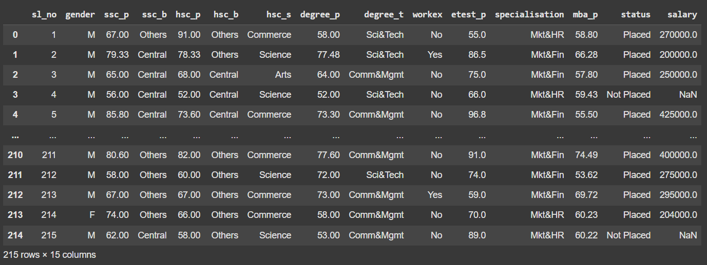
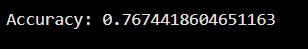
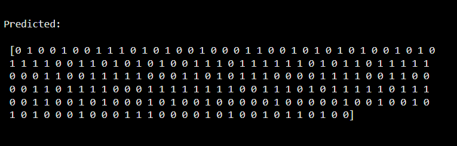
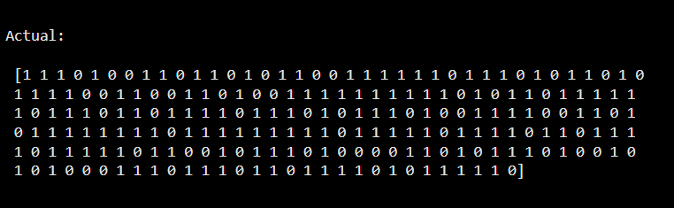
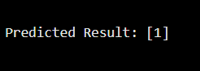

# Implementation-of-Logistic-Regression-Using-Gradient-Descent

## AIM:
To write a program to implement the the Logistic Regression Using Gradient Descent.

## Equipments Required:
1. Hardware – PCs
2. Anaconda – Python 3.7 Installation / Jupyter notebook

## Algorithm

1.Import Necessary Libraries: Import NumPy, pandas, and StandardScaler for numerical operations, data handling, and feature scaling, respectively.

2.Define the Linear Regression Function: Create a linear regression function using gradient descent to iteratively update parameters, minimizing the difference between predicted and actual values.

3.Load and Preprocess the Data: Load the dataset, extract features and target variable, and standardize both using StandardScaler for consistent model training.

4.Perform Linear Regression: Apply the defined linear regression function to the scaled features and target variable, obtaining optimal parameters for the model.

5.Make Predictions on New Data: Prepare new data, scale it, and use the trained model to predict the target variable, transforming predictions back to the original scale.

6.Print the Predicted Value

## Program:
```

Program to implement the the Logistic Regression Using Gradient Descent.
Developed by: Krishna Prasad S
RegisterNumber:  212223230108

```
```

import pandas as pd
import numpy as np

# Load and preprocess the data
data = pd.read_csv("Placement_Data.csv")
# Displaying the Dataset
data

from sklearn.preprocessing import LabelEncoder
le = LabelEncoder()
data1 = data.drop(['sl_no', 'salary'], axis=1)
data1["gender"] = le.fit_transform(data1["gender"])
data1["ssc_b"] = le.fit_transform(data1["ssc_b"])
data1["hsc_b"] = le.fit_transform(data1["hsc_b"])
data1["hsc_s"] = le.fit_transform(data1["hsc_s"])
data1["degree_t"] = le.fit_transform(data1["degree_t"])
data1["workex"] = le.fit_transform(data1["workex"])
data1["specialisation"] = le.fit_transform(data1["specialisation"])
data1["status"] = le.fit_transform(data1["status"])
# Dataset after labelling
data1

# Split features and target
X = data1.iloc[:, :-1].values  # Features
Y = data1["status"].values  # Target variable

# Feature Scaling
from sklearn.preprocessing import StandardScaler
scaler = StandardScaler()
X = scaler.fit_transform(X)

# Initialize parameters
theta = np.random.randn(X.shape[1])  # Random initialization
alpha = 0.01  # Learning rate
num_iterations = 1000  # Number of iterations

# Define sigmoid function
def sigmoid(z):
    return 1 / (1 + np.exp(-z))

# Define loss function
def loss(theta, X, y):
    h = sigmoid(X.dot(theta))
    return -np.sum(y * np.log(h + 1e-15) + (1 - y) * np.log(1 - h + 1e-15)) / len(y)

# Gradient Descent function
def gradient_descent(theta, X, y, alpha, num_iterations):
    m = len(y)
    for i in range(num_iterations):
        h = sigmoid(X.dot(theta))
        gradient = X.T.dot(h - y) / m
        theta -= alpha * gradient
    return theta

# Train the model
theta = gradient_descent(theta, X, Y, alpha, num_iterations)

# Prediction function
def predict(theta, X):
    h = sigmoid(X.dot(theta))
    return np.where(h >= 0.5, 1, 0)

# Model evaluation
y_pred = predict(theta, X)
accuracy = np.mean(y_pred == Y)

# Display Results
print("Accuracy:", accuracy)
print("\nPredicted:\n\n", y_pred)
print("\nActual:\n\n", Y)

# Predictions for new data
xnew = np.array([[0, 87, 0, 95, 0, 2, 78, 2, 0, 0, 1, 0]])  # Example input
xnew = scaler.transform(xnew)  # Apply same scaling as training data
y_prednew = predict(theta, xnew)
print("\nPredicted Result:", y_prednew)

```
## Output:

### DATASET:


### LABELLED DATASET:


### ACCURACY:


### PREDICTED VALUES:


### ACTUAL VALUES:


### DISPLAY PREDICTED RESULT:


## Result:
Thus the program to implement the the Logistic Regression Using Gradient Descent is written and verified using python programming.

